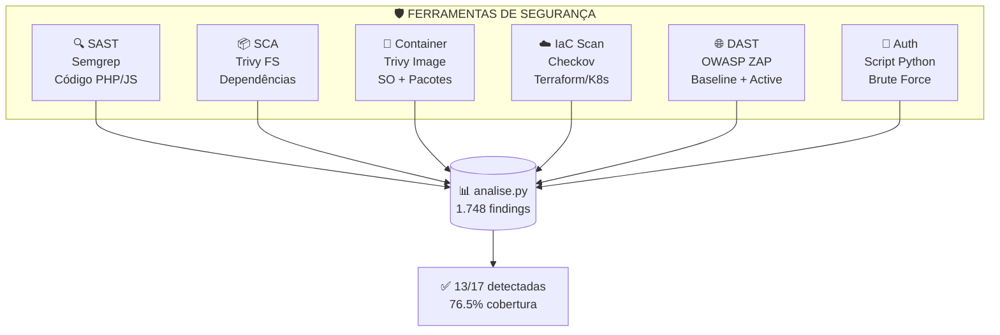
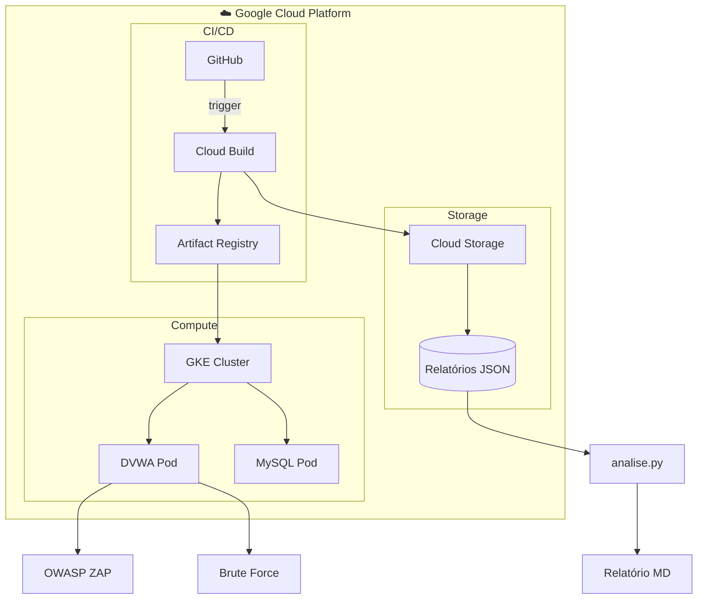
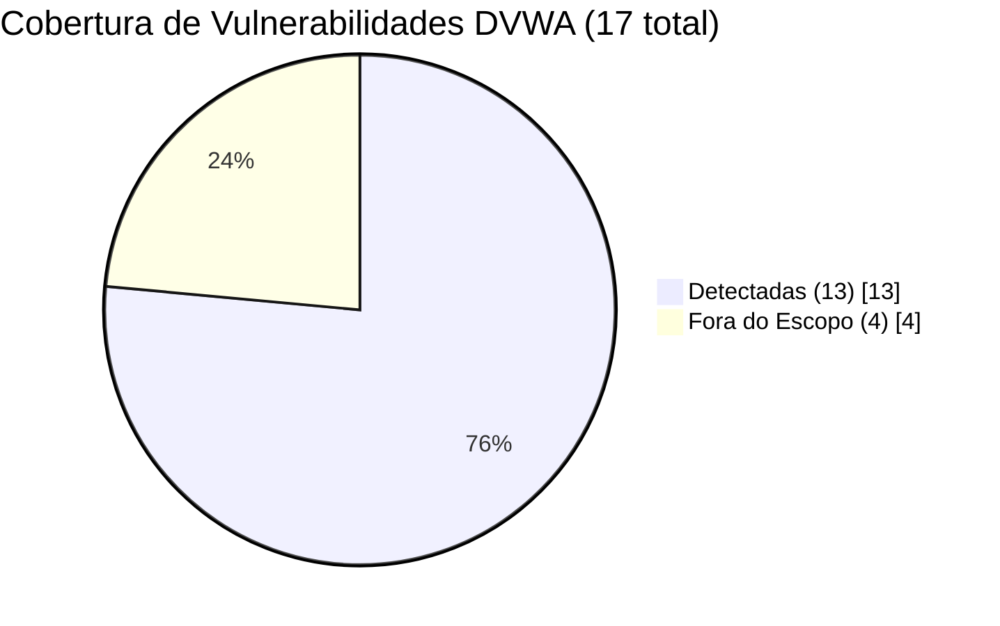

# Uma Abordagem DevSecOps para Inserção e Automação de Práticas de Segurança em Pipelines CI/CD

O objetivo deste projeto é investigar e implementar práticas de segurança em pipelines de Integração Contínua e Entrega Contínua (CI/CD), utilizando os princípios de DevSecOps. A pesquisa busca demonstrar como a automação de verificações de segurança, por meio de ferramentas como SAST, DAST, SCA e IaC scanning, pode ser integrada de forma prática em pipelines CI/CD, garantindo que vulnerabilidades sejam detectadas desde as primeiras etapas do ciclo de desenvolvimento.

Além disso, o projeto propõe a utilização de recursos do Google Cloud Platform (GCP), incluindo Cloud Build, Artifact Registry e Google Kubernetes Engine (GKE), provisionados via Terraform, como ambiente controlado para validação da abordagem. A análise dos resultados será qualitativa, focando na efetividade da integração das ferramentas, no nível de automação alcançado e nas boas práticas observadas na implementação de DevSecOps.

## Alunos integrantes da equipe

* Guilherme Henrique de Lima Machado

## Professores responsáveis

* **Orientador do TCC:** Fabio Cordeiro
* **Orientador da Pesquisa (TIPI):** [Lesandro Ponciano](https://orcid.org/0000-0002-5724-0094)

---

## 📊 Visão Geral do Pipeline

### Arquitetura do Pipeline (15 Etapas)

```mermaid
flowchart LR
    subgraph SHIFT_LEFT["🔍 SHIFT-LEFT"]
        A[1. Clone] --> B[2. SAST<br/>Semgrep]
        B --> C[3-4. SCA<br/>Trivy FS]
        C --> D[5-6. IaC<br/>Checkov]
    end
    
    subgraph BUILD["🔨 BUILD"]
        D --> E[7. Docker<br/>Build]
        E --> F[8. Container<br/>Scan]
        F --> G[9. Push<br/>Registry]
    end
    
    subgraph DEPLOY["🚀 DEPLOY"]
        G --> H[10. Deploy<br/>GKE]
        H --> I[11. Setup<br/>DVWA]
    end
    
    subgraph SHIFT_RIGHT["🎯 SHIFT-RIGHT"]
        I --> J[12. DAST<br/>Baseline]
        J --> K[13. DAST<br/>Active]
        K --> L[14. Brute<br/>Force]
        L --> M[15. Upload<br/>GCS]
    end
```



### 6 Camadas de Segurança



### Arquitetura GCP



### Cobertura de Detecção



| Métrica | Valor |
|---------|-------|
| **Total de Findings** | 1.748 |
| **Vulnerabilidades DVWA** | 17 |
| **Detectadas** | 13 (76,5%) |
| **Cobertura Ajustada** | 100% |

---

## Instruções de Replicação/Reprodução

Este projeto pode ser replicado seguindo os passos abaixo:

### Requisitos

- Conta no **Google Cloud Platform (GCP)** com permissões para criar:
  - Projetos, VPCs e sub-redes
  - Clusters GKE
  - Artifact Registry
  - Buckets no Cloud Storage
  - Cloud Build
- **Terraform** instalado (>= 1.5)
- **Google Cloud SDK** instalado e autenticado
- **Docker** instalado para testes locais opcionais
- Código-fonte ou imagem do **DVWA (Damn Vulnerable Web Application)**


### Provisionamento do ambiente com Terraform

1. Navegue até a pasta de infra do projeto:

```bash
cd infra
```
2. No arquivo `terraform.tfvars` ajuste o project_id para o projeto que será utilizado no gcp.

3. Inicialize o Terraform:

```bash
terraform init
```

4. Visualize o plano de execução:

```bash
terraform plan
```

5. Aplique o Terraform para criar todos os recursos:

```bash
terraform apply
```

* Confirme com `yes` quando solicitado.
* Recursos criados:

  * VPC e sub-redes
  * Cluster GKE
  * Artifact Registry
  * Bucket GCS para relatórios de segurança
  * IAM binding para permitir que o Cloud Build grave no bucket

6. Verifique os recursos criados:

```bash
gcloud container clusters list
gcloud artifacts repositories list
gsutil ls gs://devsecops-reports
```

### Preparar a aplicação e Docker(DVWA)

O projeto utiliza a aplicação DVWA (Damn Vulnerable Web Application) como base para testes de segurança.
O DVWA é uma aplicação web vulnerável escrita em PHP/MySQL, amplamente usada em laboratórios de pentest e DevSecOps, permitindo avaliar a efetividade de ferramentas de varredura em um ambiente controlado.


1. O pipeline utilizará a imagem oficial do DVWA disponível no Docker Hub:
2. (Opcional) Teste build da imagem local:

```bash
docker pull vulnerables/web-dvwa
docker run -d -p 8080:80 vulnerables/web-dvwa
```

* Acesse `http://localhost:8080` para confirmar funcionamento.


### Configuração do Cloud Build

1. Verifique o arquivo `cloudbuild.yaml` na pasta `Instrumentos/Codigos/DevSecOps/dvwa/` do projeto.
2. Ajuste as substituições conforme seu ambiente:

```yaml
substitutions:
  _ARTIFACT_REPO: "devsecops-repo"
  _REGION: "us-central1"
  _PROJECT_ID: "<SEU_PROJECT_ID>"
  _CLUSTER_NAME: "devsecops-cluster"
  _APP_NAME: "dvwa-app"
  _DEPLOYMENT_NAME: "dvwa-app"
  _REPORT_BUCKET: "gs://devsecops-reports-dvwa"
  _SOURCE_IMAGE: "vulnerables/web-dvwa:latest"
  _DVWA_USER: "admin"
  _DVWA_PASS: "password"
```

3. Confirme que a **conta de serviço do Cloud Build** possui permissões:

* Acesso ao GKE
* Acesso ao Artifact Registry
* Escrita no bucket GCS


### Executar o pipeline

1. Dispare o build no Cloud Build:

```bash
gcloud builds submit --config Instrumentos/Codigos/DevSecOps/dvwa/cloudbuild.yaml .
```

* **Etapas do pipeline (cloudbuild.yaml):**

| Step | ID | Ferramenta | Descrição |
|------|-----|------------|-----------|
| 0 | `setup` | Ubuntu | Cria diretório de relatórios |
| 1 | `pull-dvwa` | Docker | Pull da imagem DVWA pública |
| 2 | `push-dvwa` | Docker | Tag da imagem para Artifact Registry |
| 3 | `push` | Docker | Push da imagem para Artifact Registry |
| 4 | `semgrep` | Semgrep | **SAST** - Análise estática do código |
| 5 | `sca-scan` | Trivy | **SCA** - Análise de dependências |
| 6 | `checkov` | Checkov | **IaC Scan** - Terraform e Kubernetes |
| 7 | `trivy` | Trivy | **Container Scan** - Análise da imagem |
| 8 | `deploy-mysql` | kubectl | Deploy do MySQL no GKE |
| 9 | `deploy` | kubectl | Deploy do DVWA no GKE |
| 10 | `get-external-ip` | kubectl | Obtém IP externo do LoadBalancer |
| 11 | `zap-scan` | OWASP ZAP | **DAST** - Baseline Scan (não autenticado) |
| 12 | `zap-auth-active-scan` | OWASP ZAP | **DAST** - Active Scan autenticado (SQLi, XSS) |
| 13 | `bruteforce-attack` | Python Script | **Brute Force** - Teste com suporte a CSRF token |
| 14 | `upload-reports` | gsutil | Upload dos relatórios para GCS |
| 15 | `get-service-ip` | kubectl | Exibe IP externo do DVWA |

2. Acompanhe logs:

```bash
gcloud builds list
gcloud builds log <BUILD_ID >
```

### Avaliação dos resultados

1. Acesse o bucket GCS para conferir relatórios:

```bash
gsutil ls gs://devsecops-reports-dvwa/reports-<SHORT_SHA>/
```

2. **Relatórios gerados por cada ferramenta:**

| Ferramenta | Arquivo | Formato |
|------------|---------|---------|
| Semgrep | `semgrep-report.json` | JSON |
| Trivy (SCA) | `trivy-sca-report.json` | JSON |
| Trivy (Container) | `trivy-report.json` | JSON |
| Checkov (Terraform) | `checkov-terraform.json` | JSON |
| Checkov (K8s) | `checkov-k8s.json` | JSON |
| Checkov (Combinado) | `checkov-report.json` | JSON |
| OWASP ZAP | `zap-report.json`, `zap-report.html` | JSON/HTML |
| ZAP Autenticado | `zap-auth-active-report.json`, `zap-auth-active-report.html` | JSON/HTML |
| Brute Force | `hydra-bruteforce.json` | JSON |

3. Pontos de análise qualitativa:

* Efetividade da integração das ferramentas no pipeline
* Nível de automação alcançado na detecção de vulnerabilidades
* Boas práticas observadas na implementação de DevSecOps
* Detecção e mitigação de vulnerabilidades em cada etapa do pipeline

4. Repita o build sempre que desejar testar alterações na aplicação ou na configuração do pipeline. Cada build gera um novo diretório no bucket para manter histórico completo.


### Script de Análise de Cobertura (`analise.py`)

Um dos principais diferenciais deste projeto é o **script de análise automatizada** (`Instrumentos/Reports/analise.py`) em Python que consolida e interpreta os relatórios de todas as ferramentas de segurança.

#### Por que foi criado?

Cada ferramenta de segurança gera relatórios em formatos diferentes (JSON, HTML), com estruturas distintas e sem padronização de CWEs. Analisar manualmente **1700+ findings** de 6 ferramentas diferentes seria inviável. O script resolve esse problema automatizando toda a análise.

#### Funcionalidades Principais

| Funcionalidade | Descrição |
|----------------|-----------|
| **Parsing Unificado** | Lê e interpreta relatórios de Trivy, Semgrep, Checkov, ZAP e Brute Force |
| **Normalização de CWEs** | Padroniza identificadores CWE de diferentes formatos (ex: `CWE-89`, `CWE:89`) |
| **Comparação com DVWA** | Compara findings com as 17 vulnerabilidades conhecidas do DVWA |
| **Cálculo de Cobertura** | Calcula cobertura geral (76.5%) e ajustada (100%) |
| **Identificação de Gaps** | Identifica vulnerabilidades fora do escopo de automação |
| **Geração de Relatório** | Gera relatório Markdown consolidado e formatado |

#### Estrutura do Script

```python
# Constantes principais
DVWA_KNOWN_VULNERABILITIES = {...}      # 17 vulnerabilidades conhecidas do DVWA
OUT_OF_SCOPE_VULNERABILITIES = {...}    # 4 vulnerabilidades não automatizáveis

# Funções de análise por ferramenta
analyze_trivy_container()    # Container Scan - CVEs na imagem Docker
analyze_trivy_sca()          # Software Composition Analysis
analyze_semgrep()            # SAST - Análise estática PHP/JS
analyze_checkov()            # IaC Scan - Terraform e K8s
analyze_zap()                # DAST Baseline - Scan passivo
analyze_zap_active()         # DAST Active - Scan autenticado
analyze_hydra()              # Brute Force - Credenciais

# Função principal de comparação
compare_with_known_vulnerabilities()    # Calcula cobertura e identifica gaps

# Classe de geração de relatório
class MarkdownReport:                   # Gera relatório final formatado
```

#### Métricas Calculadas Automaticamente

- **Cobertura Geral:** Vulnerabilidades detectadas / Total conhecido (76.5%)
- **Cobertura Ajustada:** Detectadas / (Total - Fora do Escopo) (100%)
- **Findings por Severidade:** CRITICAL, HIGH, MEDIUM, LOW
- **Findings por Ferramenta:** Distribuição entre as 6 ferramentas
- **CWEs Detectados vs Esperados:** Validação específica do ZAP Active Scan

#### Execução

```bash
cd Instrumentos/Reports/
python3 analise.py

# O script automaticamente:
# 1. Encontra os relatórios mais recentes (por prefixo de commit)
# 2. Processa todos os JSONs de cada ferramenta
# 3. Gera relatorio-vulnerabilidades.md
```

#### Saída Gerada

O arquivo `relatorio-vulnerabilidades.md` inclui:

1. **Resumo Executivo** - Métricas principais e avaliação qualitativa
2. **Análise por Ferramenta** - Detalhes de cada scan (Trivy, Semgrep, Checkov, ZAP)
3. **Tabela de Cobertura** - Vulnerabilidades detectadas vs não detectadas
4. **Vulnerabilidades Fora do Escopo** - Justificativas técnicas detalhadas
5. **Validação do ZAP Active Scan** - CWEs de injeção esperados vs detectados
6. **Recomendações** - Sugestões de melhoria para aumentar cobertura

#### Vulnerabilidades DVWA Mapeadas (17 total)

**Web Application (13):**
- SQL Injection, XSS (Reflected/Stored/DOM), Command Injection
- File Inclusion (LFI/RFI), File Upload, CSRF
- Weak Session IDs, Brute Force, Insecure CAPTCHA
- Open HTTP Redirect, JavaScript Attacks, CSP Bypass, Authorization Bypass

**Infraestrutura (4):**
- Outdated OS, Outdated Packages, Default Credentials, Exposed MySQL

#### Valor para o Projeto

O script transforma dados brutos de 6 ferramentas diferentes em **inteligência acionável**, permitindo:

- ✅ Avaliar a efetividade real do pipeline DevSecOps
- ✅ Identificar gaps de cobertura de forma objetiva
- ✅ Documentar limitações inerentes à automação
- ✅ Gerar métricas quantitativas para o artigo/TCC
- ✅ Comparar execuções diferentes do pipeline


### Observações

* O ambiente é totalmente **provisionado via Terraform**, garantindo reprodutibilidade.
* Todos os relatórios ficam armazenados em **bucket GCS**, permitindo auditoria e rastreabilidade.
* As ferramentas de segurança estão configuradas para gerar evidências de vulnerabilidades em cada etapa do pipeline, de forma automatizada.
* O uso do DVWA proporciona um ambiente intencionalmente vulnerável, permitindo observar de forma prática o funcionamento e a precisão das ferramentas automatizadas de segurança.
* **Variáveis de shell** nos scripts do Cloud Build usam `$$` para escapar e evitar conflitos com substituições do Cloud Build.
* O **IP externo** do DVWA é obtido dinamicamente e propagado via arquivo `/workspace/external_ip.txt`, não por substituição.


### Nota sobre Brute Force

O projeto utiliza um **script Python customizado** (`dvwa-bruteforce.py`) ao invés do Hydra tradicional. Isso é necessário porque:

1. O DVWA implementa proteção **CSRF** no formulário de login
2. Cada requisição requer um token `user_token` gerado dinamicamente
3. Ferramentas como Hydra não conseguem lidar nativamente com tokens CSRF

O script customizado:
- Obtém o token CSRF de cada página antes de cada tentativa
- Testa combinações de usuários/senhas comuns
- Detecta CWE-307 (Brute Force) e CWE-798 (Default Credentials)
- Gera relatório JSON estruturado para análise automatizada


## Estrutura do Projeto

```
├── Artigo/                          # Artigo e pré-projeto da pesquisa
├── Divulgacao/                      # Apresentação e vídeo
├── Fichamentos/                     # Fichamentos de artigos relacionados
├── Instrumentos/
│   ├── Codigos/
│   │   └── DevSecOps/
│   │       ├── dvwa/
│   │       │   ├── cloudbuild.yaml  # Pipeline CI/CD principal
│   │       │   └── k8s/             # Manifests Kubernetes (DVWA, MySQL)
│   │       ├── dvwa-bruteforce.py   # Script de brute force com CSRF
│   │       └── infra/               # Terraform (GKE, VPC, IAM, etc.)
│   └── Reports/
│       ├── analise.py               # Script de análise de cobertura
│       ├── relatorio-vulnerabilidades.md  # Relatório consolidado
│       └── *.json                   # Relatórios das ferramentas
├── Memorial/                        # Memorial do projeto
└── README.md                        # Este arquivo
```


## Ferramentas Utilizadas

| Categoria | Ferramenta | Descrição |
|-----------|------------|-----------|
| **SAST** | Semgrep | Análise estática de código-fonte |
| **SCA** | Trivy | Análise de dependências e composição |
| **Container Scan** | Trivy | Análise de vulnerabilidades em imagens Docker |
| **IaC Scan** | Checkov | Análise de infraestrutura como código (Terraform, K8s) |
| **DAST** | OWASP ZAP | Testes dinâmicos de segurança (full scan e autenticado) |
| **Brute Force** | Python (Custom) | Testes de força bruta com suporte a CSRF token |
| **Infra** | Terraform | Provisionamento de infraestrutura no GCP |
| **CI/CD** | Cloud Build | Pipeline de integração e entrega contínua |
| **Container** | GKE | Orquestração de containers Kubernetes |
| **Análise** | Python | Script de análise e geração de relatórios |


